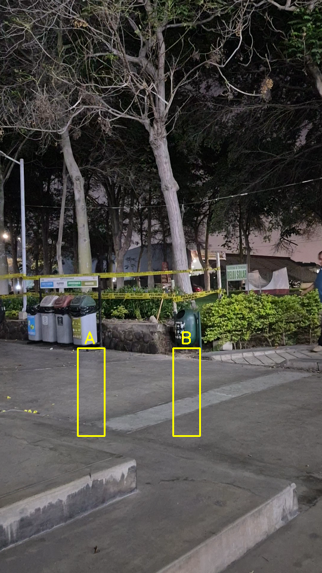
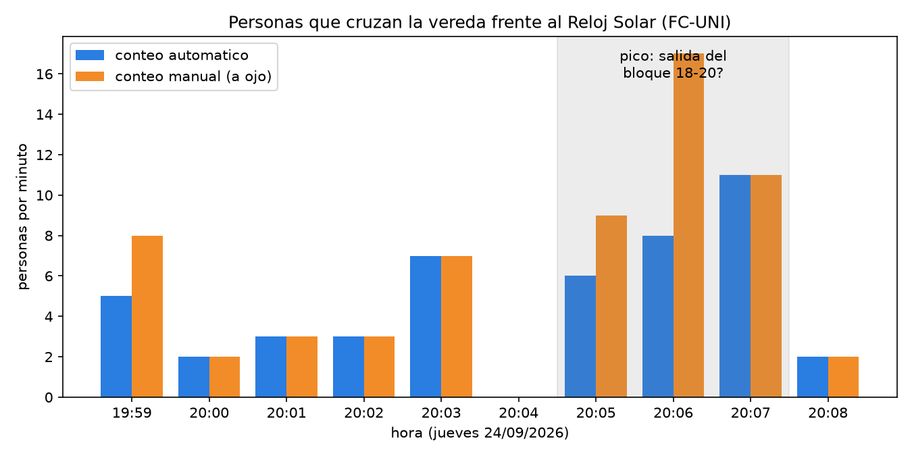
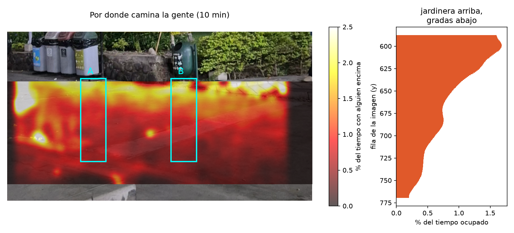

# PC1 — Conteo de personas en la vereda del Reloj Solar (FC-UNI)

**CC431 Computación Gráfica — 2026-2 — Sección A**
Equipo: Melissa, Ivette, Benjamin y Martin

Grabamos 10 min de la vereda frente al Reloj Solar de la Facultad de Ciencias
(jueves 24/09/2026, desde las 19:59) y contamos cuántas personas la cruzan y en
qué dirección, usando el script de detección de espacios de estacionamiento visto
en clase.



## Idea

El script del profe (`main.py` del repo
[deteccion_conteo_espacios_demo](https://github.com/PeterTXS09/deteccion_conteo_espacios_demo))
decide si un espacio de estacionamiento está ocupado contando píxeles blancos en un
rectángulo, después de pasar la imagen por:

```
gris -> umbral adaptativo -> filtro de mediana -> dilatación -> countNonZero
```

Nosotros usamos **exactamente ese procesamiento**, pero con **dos rectángulos** sobre
la vereda, a la altura de los pies:

- **Zona A** (izquierda) y **zona B** (derecha).
- Cuando alguien pisa una zona, el conteo de píxeles sube y luego baja: un **pulso**.
- Una persona que cruza deja un pulso en A y otro en B. **El orden da la dirección:**
  primero A y luego B → va hacia la **derecha**; primero B y luego A → hacia la **izquierda**.
- Si un pulso no tiene pareja en la otra zona (alguien que se paró o se dio la
  vuelta), no se cuenta.

Como grabamos con el celular en la mano, antes de contar **estabilizamos el video**
(opcional de la PC, +2 p).

## Scripts (en el orden en que se corren)

| Script | Qué hace |
|---|---|
| `estabilizar.py` | Alinea cada frame con el primero. Busca esquinas (`goodFeaturesToTrack`), las sigue con flujo óptico (`calcOpticalFlowPyrLK`), estima el movimiento de la cámara (`estimateAffinePartial2D` + RANSAC) y lo deshace (`warpAffine`). También reduce a 540x960 y corta a 10 min. |
| `obtener_regiones.py` | Igual que `obtener_espacios.py` del profe: con `selectROI` se marcan las zonas A y B y se guardan en `regiones.pkl`. |
| `medir.py` | Recorre el video y guarda cuántos píxeles blancos hay en cada zona por frame. Con la mediana (zona vacía) calcula el umbral = fondo + 200. Es el `if count < 900` del profe, pero medido en vez de puesto a ojo. |
| `main.py` | El contador. Mismo procesamiento que el profe, detecta pulsos, los empareja y dibuja los contadores sobre el video. |
| `evaluar.py` | Compara el conteo automático con nuestro conteo manual (`conteo_manual.csv`). |
| `reporte.py` | Gráfico de personas por minuto y extrapolación a hora, día, semana y mes. |
| `mapa_calor.py` | Suma la imagen dilatada de todos los frames para ver por dónde camina la gente. |
| `material_expo.py` | Videos y gráficos para la exposición. |

```bash
pip install -r requirements.txt matplotlib
python estabilizar.py video_original.mp4 video_estable.mp4
python obtener_regiones.py video_estable.mp4     # o usar el regiones.pkl incluido
python medir.py
python main.py                  # agregar --mostrar para verlo en vivo, como el profe
python evaluar.py
python reporte.py
```

Versiones: las mismas del repo del profe (`numpy==1.26.4`, `opencv-python==4.9.0.80`) + matplotlib.

## Resultados

| | |
|---|---|
| Video analizado | 9 min 58 s (17 937 frames, 30 fps) |
| Conteo automático | **47 personas** (19 hacia la izquierda, 28 hacia la derecha) |
| Conteo manual (a ojo) | **62 personas** (27 izquierda, 35 derecha) |
| Ventanas exactas | 25 de 33 |
| Gente caminando sola | 18 de 20 detectadas |
| Factor de corrección | 1.32 (manual / automático) |

- Video con los contadores: `resultados/video_resultado.mp4` (a la izquierda el video, a la derecha la imagen dilatada: lo que "ve" el programa)
- Original vs estabilizado (x20): `resultados/comparacion_estabilizacion.mp4`
- Procesamiento paso a paso: `resultados/procesamiento_paso_a_paso.mp4`



### ¿Por dónde camina la gente?



La mayoría camina **pegada a la jardinera**: esa franja está ocupada 1.5 % del tiempo, contra
0.4 % cerca de la cámara. Por eso las zonas A y B empiezan justo en el borde de la jardinera.

### ¿Sirvió estabilizar?

Sí. Con el mismo `main.py` y las mismas zonas:

| | sin estabilizar | estabilizado | manual |
|---|---|---|---|
| personas contadas | 30 | 47 | 62 |
| ventanas exactas (de 33) | 14 | 25 | — |
| gente caminando sola (de 20) | 12 | 18 | 20 |

El celular se movió hasta 38 px en horizontal y 62 px en vertical durante la grabación
(`resultados/movimiento_camara.png`). Sin corregirlo, las zonas terminan mirando otro
pedazo de piso.

### Extrapolación

Con el factor de corrección, pasan **~6.2 personas por minuto**. Pero el flujo no es
parejo: entre 20:05 y 20:07 (justo después de que terminan las clases de 18 a 20)
pasaron **11 por minuto**, y el resto del tiempo **~4 por minuto** (el pico es 2.7
veces el valle).

| | Todo el día igual que la muestra | Pico de 3 min cada hora + valle |
|---|---|---|
| por hora | 373 | 269 |
| por día (7:00–22:00) | 5 591 | 4 039 |
| por semana (L–V) | 27 956 | 20 197 |
| por mes (4 semanas) | 111 824 | 80 788 |

La segunda columna es más realista, pero asume que **todas** las horas tienen el mismo
pico que vimos a las 20:05, y eso no lo medimos: habría que grabar en otras horas.

## Limitaciones

- **Grupos:** dos personas caminando juntas pisan la zona al mismo tiempo y dan un
  solo pulso. Es la causa de casi todo el error (24 % de subconteo). Para parejas muy
  marcadas usamos la "masa" del pulso (píxeles × tiempo): si las dos zonas se llenan
  mucho a la vez (> 35 000), contamos 2. Ese umbral lo sacamos de nuestro propio
  conteo manual, así que puede estar ajustado de más a este video.
- **Cámara a la altura de los ojos:** la gente cerca de la cámara tapa a la de atrás.
  Una vista desde arriba (como el estacionamiento del profe) evitaría esto.
- **Una sola grabación, un solo día y una sola hora:** la extrapolación es una estimación
  gruesa.
- Se cuentan siluetas, no se identifica a nadie.
